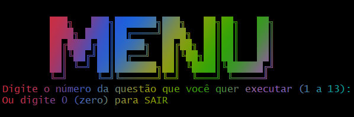
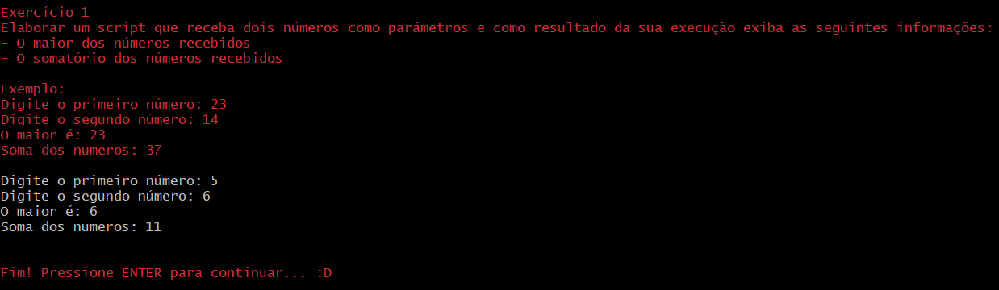
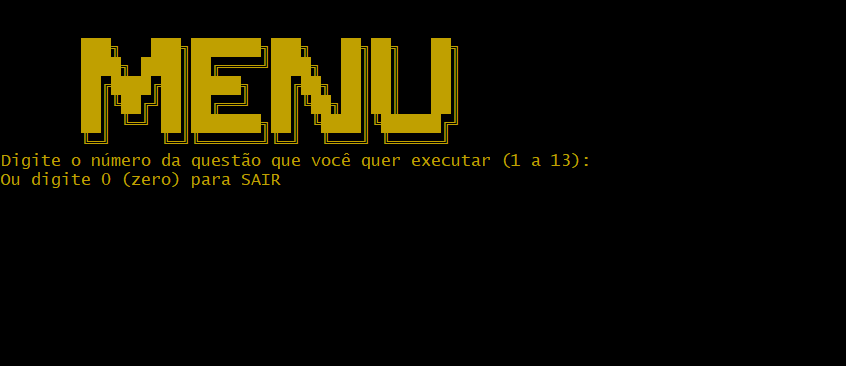
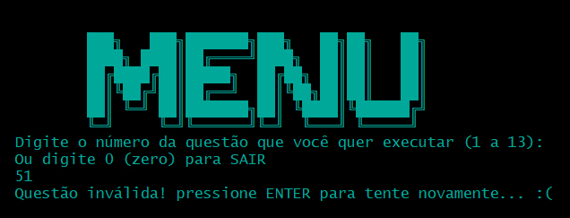
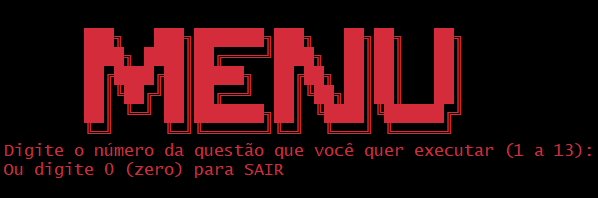

# Shell V-System
## O seu sistema confiável de exercícios shell
Está interessado na linguagem Shell? Listamos aqui algumas atividades para você!
Estudem a vontade amigos :D

## Várias questões preparadas para seu estudo e prática
Sinta-se a vontade para fazer suas próprias versões, pois os enunciados estão listados em suas respectivas questões

## Fácil de usar
- Rápido para testar
- Simples de entender

## Não tente burlar o sistema, parceiro >:(
**Mas**, se conseguir, estamos abertos a correções

## E o melhor de tudo, coloridinho
Diversão e alegria, apenas...
> As cores na pintura **(ou programa)** são como chamarizes que seduzem os olhos, como a beleza dos versos de poesia.

## Se interessou pelo nosso projeto?
Você pode fazer o download rapidamente clicando [AQUI](https://github.com/IMayanLP/ShellV-System/archive/refs/heads/main.zip)